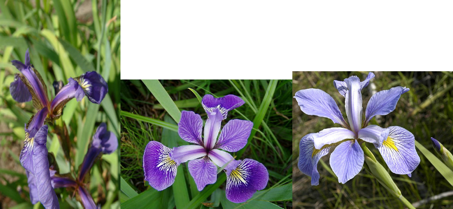

### Library Install and Usage

Libraries provide additional functions, and the packages that they are present in can be downloaded from a network of servers called the Comprehensive R Archive Network [CRAN].

Installing  packages:
```{r, eval=FALSE}
#install.packages(“PACKAGENAME”)
#Today we will use the following packages
#Please ensure that are installed before attending the session
install.packages(c("ggplot2", "ggthemes", "ggsci", "reshape2", "plotly","ggExtra"))
```

CRAN packages as well as many biology specific “Bioconductor” packages can be installed using bioconductor.
```{r, eval=FALSE}
source("http://bioconductor.org/biocLite.R")
biocLite("PACKAGENAME")
```

Other options exist such as installing from github or from local files.
```{r, eval=FALSE} 
#We will also be using this package briefly, please install before session starts
install.packages("devtools")
library(devtools)
devtools::install_github('baptiste/egg')
```
I had trouble on my windows laptop when R was installed in the default "Program Files".  I removed it and reinstalled it to a directory without spaces to enable this command to work. 

To use libraries from the various packages, use the "library" function.
```{r}
library(ggplot2)
library(ggthemes)
library(ggsci)
library(reshape2)
library(plotly)
library(ggExtra)
library(egg)
```

These are the packages that we will use today. We will be mostly using ggplot2 and touch on the functionality of the other packages.


### Fisher's Iris dataset (pre-installed in R)


Fisher examined the length and width of the petals and sepals in irises to determine a classification algorithm. Here we will explore the relationship between species and the dimension of the flowers via the ggplot2 plotting package.  Fisher’s data is stored as a built in data set in R.  Too see the data type 

```{r, eval=FALSE}
iris
```

or 
```{r}
head(iris)
```

If this does not work, you may first need to load the data via the data function

```{r}
data(iris)
head(iris)
```


### ggplot2 overview

In this workshop we will be using the ggplot2 package for plotting.

```{r}
library(ggplot2)
```

ggplot2 is a suite of functions that create a “grammar” for creating graphs. “Layers” of the graph can be added together.  You do not need to specify  details for all the layers as many of the default values are fine. 

First let's define the dataframe to use 
```{r}
p <- ggplot(iris) 
```

At this stage you can also define what columns to plot within the dataframe by using the aesthetics function, aes(). If you do this, it will be default for the whole graph. You can also define the aesthetics later within specific layers. 
	
Here are the vector names within the iris dataframe 
```{r} 
names(iris)
```


Let us plot “Sepal.Length" vs "Sepal.Width" and store it in an object "p"
```{r}
p <- ggplot(iris, aes(x=Sepal.Length, y=Sepal.Width) )
```

Note that we still need to add layers to this plot, 
```{r, error=TRUE}
p
```


The key layer to define is the geometry of the plot. There are many geometries to choose from but for now let us just use points.

```{r}
p <- p + geom_point()
```

So "p"" now contains the data and a geometry layer. Now we can plot a graph! 
```{r}
p
```

Note that each layer you add will inherit the attributes from the first layer. Aesthetics cannot be overwritten and you may want to assigned them later in the geometries. Therefore the following should not give you what you expect.

```{r}
p + geom_point(aes(x=Petal.Length, y=Petal.Width))
```
But the following works

```{r}
ggplot(iris) + geom_point(aes(x=Petal.Length, y=Petal.Width))
```
Lets go back to our object "p" with septal length versus septal width

We can colour the points in the geometry.
```{r}
p <- p + geom_point(colour="red")
p
```

Not very informative though, let’s start again and colour the points by species.

```{r}
p <- ggplot(iris, aes(x=Sepal.Length, y=Sepal.Width, colour=Species) ) +  geom_point()
p
```

Each function within the ggplot package has it own help file associated with it.
```{r, eval=FALSE}
?geom_point()
```

Note that all the geometries also define a statistical transformation. In this case identity is just the value that is presented. Other geometries have different defaults. 

Also the points were coloured by species using

 colour=Species
 
If a geometry was used that had boxes, such as geom_boxplot() or geom_bar(), these boxes can be filled with colour using 

  fill=Species

within the aesthetics function, aes(). 

Here is an example using the histogram geometry. I'm setting the binwidth to a more sensible default.

```{r}
h<- ggplot(iris, aes(Sepal.Length/Sepal.Width, fill=Species )) +geom_histogram(binwidth=0.1)
h
```


### Changing the theme

Recap: 
```{r}
p <- ggplot(iris, aes(x=Sepal.Length, y=Sepal.Width, colour=Species) ) +  geom_point() 
```


We can continue to modify the plot. Let’s make the axis a bit prettier with the xlab() and ylab() functions 

```{r, error=T}
p <- p + xlab('Sepal length') + ylab('Sepal width') 
```
All the characteristics of the plot, such as text size and the background are managed by the function called theme()

You can use a theme with predefined defaults
```{r}
p + theme_bw()
```

or create you own from scratch 
```{r}
p + theme(
    		panel.background = element_blank(), 
     		panel.grid.major = element_line(colour = "darkgrey"), 
     		text = element_text(size=12), 
     		axis.title.x=element_blank(), 
     		axis.title.y=element_blank(), 
     		panel.grid.minor.y=element_blank(),  
     		panel.grid.major.y=element_blank()     
    		)
# Note you can save your theme and reuse it 
theme_for_nature <- theme(
    		panel.background = element_blank(), 
     		panel.grid.major = element_line(colour = "darkgrey"), 
     		text = element_text(size=12), 
     		axis.title.x=element_blank(), 
     		axis.title.y=element_blank(), 
     		panel.grid.minor.y=element_blank(),  
     		panel.grid.major.y=element_blank()     
    		)
```

We can reuse the theme, for example on the histogram we made earlier.
```{r}
h + theme_for_nature
```

Note that theme() changes the underlying graph properties and not the layers themselves. 

There are pre-computed themes availabe, R-studio will offer help choosing them by offering choices after typing "theme_". There are other packages available to download such as the ggthemes package. Here is one based on https://fivethirtyeight.com/ .

```{r}
library(ggthemes)
h + theme_fivethirtyeight()
```


### Saving the plots 

In RStudio there are many options to save the image.  From the Plots tab, select Export and "Save as Image".  

If you are are wanting to use ggplot2 in a script, or from another platform, you can export a graph using the function ggsave().

```{r, eval=FALSE}
#save a png file 
ggsave("IrisDotplot.png", p)
#save a jpeg file
ggsave("IrisDotplot.jpg", p)
#save a pdf 
ggsave("IrisDotplot.pdf", p)
#save a svg
ggsave("IrisDotplot.svg", p)
```

In this you can also set the resolution for the image as well as the length and width for the image. See the help page for ggsave for more options. 

### Colouring points and bars

As we have seen, points (and bars) can be coloured by a value in your dataframe using the aes() function. Earlier we coloured by a factor but we can also colour by a value which will create a gradient of colour. 
Lets look at the Petals this time and colour by the ratio of Sepal.Length to Sepal.Width.
```{r}
q <- ggplot(iris, aes(x=Petal.Length, y=Petal.Width, colour=Sepal.Length/Sepal.Width )) +  geom_point() 
q
```

To change the colours we need use another suite of functions which are not unique to ggplot2. There are several options and we will go through a few examples.

Lets first look at a function from  colorbrewer.org.  Details can be found [here](http://docs.ggplot2.org/dev/scale_brewer.html). 

In this package continuous scales use scale_color_distiller() function whereas discrete factors can scale_colour_hue.

```{r}
q + scale_color_distiller(palette="Paired")
```

An alternative method is to use the scale_color_gradient2() function. 
```{r}
q + scale_color_gradient2(high="darkred", low="blue",  mid="red", midpoint=2, space="Lab")
```

Note that for bars, you need to specify the fill colour. Lets use the histogram, h, we made earlier.


```{r}
h+ scale_fill_manual(values = c("magenta","cyan", "darkblue"))
```

The options for colouring graphs are huge.  The help pages for many of the functions will refer to the general help page for that package. 

```{r, eval=FALSE}
?scale_color_distiller
?scale_fill_manual
?scale_color_brewer
```

There is plenty of help to be found on the web for colouring in R such as [this in-depth "CookBook" of R code snippets for ggplot2](http://www.cookbook-r.com/Graphs/Colors_(ggplot2)/)

Moreover [color brewer 2](http://colorbrewer2.org) is a great site for getting the hex values of colours to suite needs such as printer or colour blind friendlyness.

Like themes, there are several packages available on CRAN or other package sites that have pre-built colour pallates. [ggsci](https://cran.r-project.org/web/packages/ggsci/vignettes/ggsci.html) is one that contains palletes based on key journals.

e.g. for Nature Publishing Group
```{r}
library(ggsci)
h + scale_fill_npg()
```


### Faceting 
Let's look at plot q again 
```{r}
q <- ggplot(iris, aes(x=Petal.Length, y=Petal.Width, colour=Sepal.Length/Sepal.Width )) +  geom_point() 
q
```

We have most of the data in this plot except Species.

Multiple plots can easily be generated if we have one or two factors by which to split the plots. The splitting is called facetting. This is achieved using either the function facet_grid() or facet_wrap().


```{r}
q + facet_grid(~Species)
```

In this case facet_wrap() would have produced an identical plot. The syntax facet_grid(factorY ~ factorX) will produce an X by Y grid with all factorY values down one side and all factorX values along the other. If data is missing for pairs of factors, a blank graph will be produced. facet_wrap() does not constrain the multiple plots into a grid and instead just creates all plots that have data. 

### Additional functions 

The boxplot geometry needs the x value to be a factor. If we try and plot it the wrong way, it will not work correctly. 

```{r, error=TRUE}
b <- ggplot(iris, aes(y=Species, x=Sepal.Length )) +  geom_boxplot() 
b
```

Whereas this is ok
```{r}
b <- ggplot(iris, aes(x=Species, y=Sepal.Length )) +  geom_boxplot() 
b
```

To change the axes we can use another function called coord_flip()

```{r}
b <- b + coord_flip()
b
```

We can also reverse the order of the axes.  Note that even although we have flipped the plots, the Species is still technically the x-axis.

```{r}
b + scale_y_reverse()
```

Changing the order of the Species is best done by creating ordered factors in the iris dataset. Also we need to generate the plot again as the underlying data has changed.

```{r}
iris$Species <- ordered(iris$Species, levels=c("virginica", "setosa",  "versicolor"))

b <- ggplot(iris, aes(x=Species, y=Sepal.Length )) +  geom_boxplot() + coord_flip()
b
```


More details at the [cookbook snipped for ordering factors ](http://www.cookbook-r.com/Manipulating_data/Changing_the_order_of_levels_of_a_factor/)


### Problems with overlays and advantages of the long format

Say we want to plot all values per species as a boxplot. 

As stated earlier, defaults are generated early as we add data to the plot. Also it is difficult to interact with the layers to make the plot look nice. 

```{r}
d <- ggplot(iris)
b1 <- geom_boxplot(aes(x=Species, y=Sepal.Length))
b2 <- geom_boxplot(aes(x=Species, y=Sepal.Width))
b3 <- geom_boxplot(aes(x=Species, y=Petal.Width))
b4 <- geom_boxplot(aes(x=Species, y=Petal.Length))
d + b1 +b2 + b3 + b4
```

Note how the axis labels are set to the first layer. Also there is not much control on where the boxes are placed. 

One way around this, is to change the data for the plot. We can change the data to a "long" format such that each column header becomes a factor for the value. We can use the reshape2 library to do this.

```{r}
library(reshape2)
iris.long <- melt(iris)
head(iris.long)
```
The melt function has correctly guessed that we want to use Species as the varable keep for the identifier. If we have multiple columns to wanted to keep, we could use the id.vars argument, eg  

 melt(data, id.vars=c("Col1", "Col2"))


Let's rename the variable column to something sensible.
```{r} 
#check what we want to change 
names(iris.long)
#change just column 2
names(iris.long)[2] = "Flower.Part"
#Check the results
names(iris.long)
```

Now it is easy to create the boxplot we wanted. 

```{r} 
bigbox <- ggplot(iris.long, aes(Species, value, fill=Flower.Part)) + geom_boxplot()
bigbox
```

Also note that the 1st value to aes() is assumed to be x, the second assumed to be y.


### Interactive graphs with Plotly 

  "Plotly for ggplot2 is an interactive, browser-based charting library built on the open source javascript graphing library, plotly.js. It works entirely locally, through the HTML widgets framework. See up-to-date documentation and examples at https://plot.ly/ggplot2"

```{r}
library(plotly)
```

Use the ggplotly function to get an interactive plot 

```{r} 
ggplotly(p)
```

Plot.ly graphs can be used locally, or online either through a shiny server (you need to use renderPlotly and plotlyOutput) or using plot.ly's servers to get a URL (details on their web page).

### R-Studio Add-ins 

The latest version of R-studio has some useful addins.  "ggExtra" has the ggMarginal function that allows you to add plots to the margins of the your plot. 
```{r}
library(ggExtra)
ggMarginal(p)
```

Lets change the theme so that the legend is not in the way and then change the plot to a histogram rather then a line density. 

```{r}
ggMarginal(p + theme_fivethirtyeight(), type="histogram", binwidth=0.1)
```


### Multi-plot Layouts

The egg library makes it easy to arrange multiple plots 

```{r}
library(egg) # devtools::install_github('baptiste/egg')
ggarrange(p,q,h)
```

The man page will provide more information on how to specify number of columns or rows, e.g.
```{r}
ggarrange(p,q,h, ncol=2) 
```

and it can be combined with ggsave
```{r eval=FALSE}
ggsave("test.png", ggarrange(p,q,h, ncol=2) )
```


